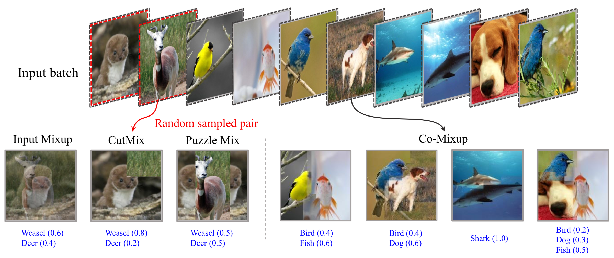

# Co-Mixup: Saliency Guided Joint Mixup with Supermodular Diversity
This is the code for "Co-Mixup: Saliency Guided Joint Mixup with Supermodular Diversity" accepted at **ICLR'21 Oral** ([paper](https://openreview.net/forum?id=gvxJzw8kW4b)). Some parts of the codes are borrowed from Puzzle Mix ([link](https://github.com/snu-mllab/PuzzleMix)).



## Citing this Work 
```
@inproceedings{
kim2021comixup,
title={Co-Mixup: Saliency Guided Joint Mixup with Supermodular Diversity},
author={JangHyun Kim and Wonho Choo and Hosan Jeong and Hyun Oh Song},
booktitle={International Conference on Learning Representations},
year={2021}
}
```

## Requirements
This code is tested with  
python 3.7.6   
pytorch 1.7.0    
torchvision 0.8.1    
CUDA 11.1  
cuDNN 7603

Also, we should install  
gco-wrapper (https://github.com/Borda/pyGCO)

## Download Checkpoints and Test
We provide Co-Mixup training log files with (PreActResNet18, CIFAR-100, 300 epochs) (see ./checkpoint). The last checkpoint shows 80.19% clean test accuracy. 

To download the model, install gdown and run
```
pip install gdown  
gdown https://drive.google.com/uc?id=1awBkSLxQKHUry-jkbDB1aMRBgIn5aT3F -O ./checkpoint/cifar100_preactresnet18_eph300_comixup/checkpoint.pth.tar
```

To test the model, run
```
python main.py --evaluate --log_off --parallel False --resume ./checkpoint/cifar100_preactresnet18_eph300_comixup/checkpoint.pth.tar --data_dir ./data/cifar100/
```
Note that, CIFAR-100 dataset will be downloaded at ```--data_dir```, if the dataset dose not exist. 

## Reproducing the results
Detailed descriptions of arguments are provided in ```main.py```. Below are some of the examples for reproducing the experimental results. 

### CIFAR-100
Dataset will be downloaded at ```--data_dir``` and the results will be saved at ```--root_dir```. If you want to run codes without saving results, please set ```--log_off True```.

* To reproduce **Co-Mixup with PreActResNet18 for 300 epochs**, just run python main.py.  
The detailed setting is 
```
python main.py --dataset cifar100 --data_dir ./data/cifar100/ --root_dir ./experiments/cifar100 --labels_per_class 500 --arch preactresnet18  --learning_rate 0.2 --epochs 300 --schedule 100 200 --gammas 0.1 0.1 --comix True --parallel True --m_part 20 --m_block_num 4 --mixup_alpha 2.0 --clean_lam 1.0 --m_beta 0.32 --m_gamma 1.0 --m_thres 0.83 --m_eta 0.05 --m_omega 0.001
```

### Some notes
- --labels_per_class controls the amounts of training data per class. To train with CIFAR-10, set ```--labels_per_class 5000```.  
- We have built pytorch multiprocessing module for Co-Mixup. To use this, set ```--parallel True``` (default). However, this requires additional GPU memory (the more the number of partition, the more the number of processes, about 1GB GPU memory per CUDA process). If OOM occurs, set ```--parallel False``` or increase the number of partition size ```--m_part```. One can also modify the code and use different numbers of partitions and processes.
- The number of processes in dataloader ```--workers``` has a significant impact on training time. I set 0 for CIFAR (using only main thread) and 8 for Tiny-ImageNet.
- To reduce training time, set ```--m_niter 3``` (the number iterations for the outer loop of Co-Mixup).  
- Considerable range of parameters are m_beta: [0.16, 0.48], m_thres: [0.81, 0.84] in the case of 4 block_num.  
- Clean input regularization by ```--clean_lam``` allow us to use high ```--mixup_alpha```. If we set --clean_lam 0, then --mixup_alpha should be decreased accordingly.
- The codes for other baselines are provided in [link](https://github.com/snu-mllab/PuzzleMix).

### Tiny-Imagenet-200
#### Download dataset
The following process is forked from ([link](https://github.com/vikasverma1077/manifold_mixup/tree/master/supervised)).

1. Download the zipped data from https://tiny-imagenet.herokuapp.com/
2. If not already exiting, create a subfolder "data" in root folder "Co-Mixup"  
3. Extract the zipped data in folder Co-Mixup/data
4. Run the following script (This will arange the validation data in the format required by the pytorch loader)
```
python load_data.py
```

* To reproduce **Co-Mixup with PreActResNet18 for 1200 epochs**, run:
```
python main.py --dataset tiny-imagenet-200 --data_dir ./data/tiny-imagenet-200 --root_dir ./experiments/tiny --labels_per_class 500 --arch preactresnet18 --learning_rate 0.2 --epochs 1200 --schedule 600 900 --gammas 0.1 0.1 --workers 8 --comix True --parallel True --m_part 20 --m_block_num 4 --mixup_alpha 2.0 --clean_lam 1.0 --m_beta 0.32 --m_gamma 1.0 --m_thres 0.83 --m_eta 0.05 --m_omega 0.001
```

### ImageNet
For ImageNet experiments, please refer to ```./comix-imagenet```. We also provide test code for localization and robustness experiments at ```./comix-localization```. You can also download pretrained models at ```./comix-localization```.

### License
MIT License
